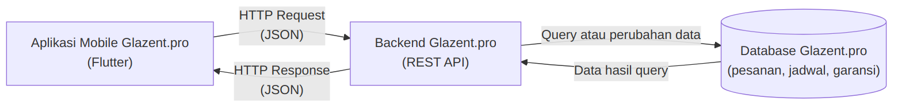
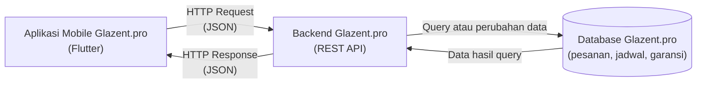

# Tugas 1 — Identifikasi Kebutuhan Aplikasi Bergerak

| | |
|:--|:--|
| **Nama** | FAJAR |
| **NIM** | 230660221093 |
| **Kelas** | SI-VIIA |
| **Domain** | Usaha mikro jasa — Glazent.pro (glass cleaning & nanocoating) |

---

## 1. Deskripsi Sistem

Pengguna utama sistem ini adalah **pelanggan** Glazent.pro (rumah tangga, vendor perumahan/cluster, dan perusahaan), sedangkan pengguna lainnya adalah **teknisi lapangan** dan **pemilik usaha**. Glazent.pro adalah usaha jasa glass cleaning dan nanocoating yang permintaannya tumbuh cepat berkat branding di Instagram, tetapi dijalankan oleh pemilik dan dua teknisi tanpa sistem informasi apa pun, sehingga pemesanan, penjadwalan, riwayat pekerjaan, dan garansi belum tercatat secara sistematis; akibatnya pelanggan tidak dapat memantau status pesanan maupun masa garansinya, dan pemilik sulit melacak pekerjaan yang sedang dan sudah berjalan. Solusinya berbentuk aplikasi mobile karena pelanggan datang dari media sosial di ponsel dan hanya membuka aplikasi dalam **sesi penggunaan singkat**, sehingga alur pemesanan harus selesai dalam beberapa langkah sentuhan; teknisi juga bekerja berpindah-pindah lokasi (**konteks bergerak**), sehingga mereka membutuhkan jadwal, alamat pekerjaan, dan kamera langsung di ponsel. Selain itu, lokasi pekerjaan seperti gedung atau kawasan perumahan dapat memiliki sinyal yang tidak stabil (**konektivitas terbatas**), sehingga data jadwal dan riwayat pesanan perlu tetap dapat dilihat saat jaringan lemah.

## 2. Diagram Arsitektur

File sumber: [`diagram.mmd`](diagram.mmd) (Mermaid).

Alur: aplikasi mengirim *HTTP Request* ke backend, backend meng-query atau mengubah data di database, database mengembalikan hasilnya ke backend, lalu backend mengirim *HTTP Response* ke aplikasi.

## 3. Tabel Kebutuhan

| No. | Permintaan | Pengguna | Karakteristik Mobile yang Terkait | Fitur Aplikasi | Materi Pemenuh |
|:---:|:-----------|:---------|:----------------------------------|:---------------|:---------------|
| 1 | Melihat daftar layanan (kaca facade, jendela, kanopi, shower glass, nanocoating) beserta detailnya | Pelanggan | **Layar kecil** dan **sesi singkat**: informasi harus ringkas dan cepat ditemukan | Halaman daftar layanan dan halaman detail layanan | Minggu 3, 5 |
| 2 | Memesan layanan dengan mengisi data diri, alamat, jenis layanan, dan tanggal yang diinginkan | Pelanggan | **Interaksi sentuh**: input harus pendek dan mudah ditekan; **sesi singkat**: pemesanan selesai dalam beberapa langkah | Form pemesanan dengan validasi input dan tombol kirim | Minggu 6, 9–10 |
| 3 | Daftar layanan dan pesanan terakhir tetap tampil meski sinyal lemah | Pelanggan | **Konektivitas terbatas**: jaringan di gedung/perumahan bisa hilang kapan saja | Penyimpanan lokal (cache) daftar layanan dan pesanan | Minggu 7 |
| 4 | Memantau status pesanan dan menerima pengingat jadwal kunjungan | Pelanggan | **Konteks bergerak**: pelanggan tidak selalu membuka aplikasi, sehingga informasi perlu datang lewat notifikasi | Halaman status pesanan dan *local notification* pengingat jadwal | Minggu 9–10, 11 |
| 5 | Melihat riwayat pekerjaan dan masa berlaku garansi nanocoating | Pelanggan | **Layar kecil** dan **sesi singkat**: cukup satu halaman berisi tanggal pekerjaan dan sisa garansi | Halaman riwayat pekerjaan dan detail garansi | Minggu 7, 9–10 |
| 6 | Melihat jadwal dan alamat pekerjaan hari ini serta mengunggah foto kondisi kaca sebelum dan sesudah pengerjaan | Teknisi | **Konteks bergerak**: teknisi bekerja berpindah lokasi dan memakai kamera ponsel di tempat kejadian | Daftar tugas harian dan fitur ambil foto (kamera) | Minggu 9–10, 11 |
| 7 | Mengelola data pelanggan, menerima atau menolak pesanan, menjadwalkan dan menugaskan teknisi | Pemilik | Tidak berlaku (pekerjaan sisi server dan panel kelola) | **Di luar lingkup (backend SI)** — CRUD data dan aturan penjadwalan pada REST API dan database | Di luar PAB (Prak-backend, Basis Data) |
| 8 | Menerbitkan data garansi dan merekap laporan pekerjaan | Pemilik | Tidak berlaku (pemrosesan dan pelaporan data di server) | **Di luar lingkup (backend SI)** — perhitungan masa garansi dan laporan rekap di backend | Di luar PAB (Prak-backend, Basis Data) |

Catatan lingkup: baris 1–6 dikerjakan pada aplikasi mobile, sedangkan baris 7–8 menjadi tugas backend SI; aplikasi mobile hanya menampilkan hasilnya.

## 4. Bukti Environment Siap

| Bukti | File |
|:------|:-----|
| `flutter doctor -v` sebelum perbaikan | [`flutter-doctor/sebelum.png`](flutter-doctor/sebelum.png) |
| `flutter doctor -v` sesudah perbaikan | [`flutter-doctor/sesudah.png`](flutter-doctor/sesudah.png) |
| Aplikasi counter berjalan (target web, Chrome) | [`aplikasi.png`](aplikasi.png) |

"Tidak ditemukan Masalah"
## 5. Refleksi

Fitur perangkat yang paling relevan untuk Glazent.pro adalah kamera. Teknisi bekerja langsung di lokasi pelanggan sehingga dapat memotret kondisi kaca sebelum dan sesudah pengerjaan pada saat itu juga. Foto tersebut menjadi bukti hasil kerja sekaligus dasar klaim garansi nanocoating yang saat ini belum tercatat sama sekali.
